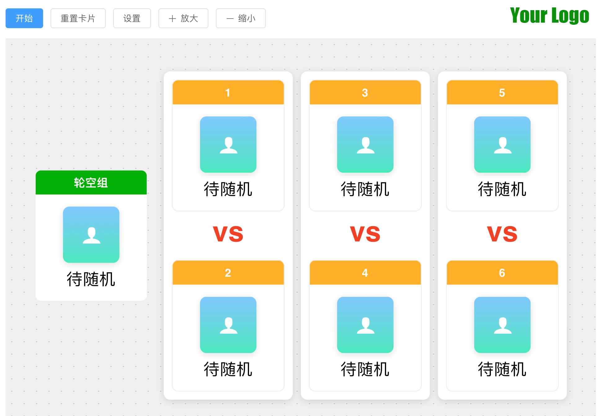

# 🎟️🎟️priceDraw🎉

一个动感的随机队员划分网页应用，自由度高，支持自定义组数和组内成员数，支持定义独立组！团建游戏利器！喜欢就star🌟🌟吧！



动效体验👉 [live demo](http://47.92.151.172/)

欢迎pr！🎉🎉

## 如何运行这个程序？

运行非常简单，如果有需要可以替换`src/assets/imgs/logo.png`进行logo的替换

如何需要更换背景音乐和音效，可以对`public/sounds`下的内容进行替换，保持同名即可

```bash
# 需要电脑先安装node.js哦！
# 进入项目文件夹执行下列命令：
npm install # 👈只有首次运行需要执行这行命令
npm run dev
# 然后浏览器访问localhost:5173即可！
# enjoy it！
```
